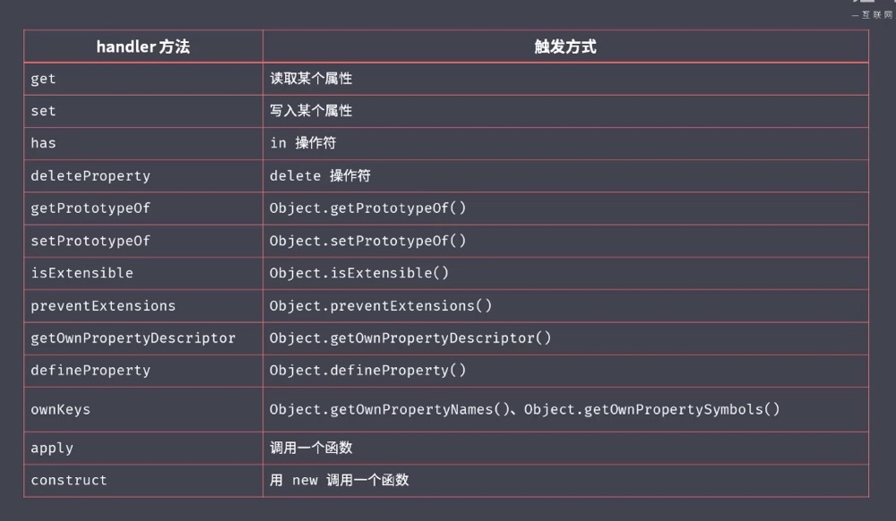

#### ECMAScript与JavaScript
##### ES概述 
ECMAScript 6（简称ES6）是于2015年6月正式发布的JavaScript语言的标准，正式名为ECMAScript 2015（ES2015）。它的目标是使得JavaScript语言可以用来编写复杂的大型应用程序，成为企业级开发语言。
另外，一些情况下ES6也泛指ES2015及之后的新增特性，虽然之后的版本应当称为ES7、ES8等。

JavaScript是ECMAScript的扩展语言, JS的语言本身就是ES, ES只提供最基本的语法, ES6更新的内容很多, 需要我们一点点的去了解.

比如新增let块级作用域, const 常量声明, es6以后 尽量不适用var声明变量.


#### es的一些新特性的简单介绍
##### 解构
ES6的解构说白了就是能够让我们一次性取到多个值

**数组的解构**

普通的一维数组解构如下
```js
let object = ['a', 'b', 'c']
let [aa, bb] = object
```
可以跳着元素解构
```js
let [,,three] = [1,2,3];
// three=3
```
可以使用...来获取后面所有的值
```js
let [one,...three] = [1,2,3];
// three=[2,3];
```
当访问空数组或则越界的时候会得到undefined；

**对象的解构**

对象解构使用{}，首先指定要解构的属性名，然后指定绑定的变量
```js
var {name:nameA,age:ageA}={name:"Jhon",age:23};
// nameA="Jhon",ageA=23
```
如果属性名和变量名一致时，可以缩写
```js
let object = {
    a: 'aaa',
    b: 'bbb'
}
let {a, b} = object
```
如果在花括号里的变量名与所要对应的对象里的属性名不相同，则该变量的返回值是undefined。如：
```js
let object = {
    a: 'aaa',
    b: 'bbb'
}
let {a, c} = object  //c变量的返回值为undefined
```


##### 模板字符串
模板字符串在使用时应用反引号包裹字符串, 模板字符串简化了字符串的拼接并支持直接/n换行,  支持插值表达式如:${name}, 模板字符串会自动执行js表达式的结果,并拼接到最终生成的普通字符串中.
需要定义标签函数: 在字符串前可以加一个标签，标签实际就是一个函数，添加标签即为调用这个函数。
```js
const result = myTagFunc`hey, ${name} is a ${gender}.`
console.log(result)
```


##### 字符串的扩展方法
在ES6中还提供了三个处理字符串的新方法，分别是includes(),startsWith(),endsWith()，见名知意
```js
const message = 'Error: foo is not defined.'

console.log(
  message.startsWith('Error')   //是否以xx开头
  message.endsWith('.')    //是否以xx结尾
  message.includes('foo')  //是否包含xx
)
```

##### 参数默认值
短路运算很多情况下是不适合判断默认参数的，例如 0 '' false null

所以如果有多个形参, 参数默认值要放在最后

##### 剩余参数
...args, 只能放在最后一位, 并且只能使用一次
```js
function foo (first, ...args) {
  console.log(args)
}

foo(1, 2, 3, 4)  //[2, 3, 4]
```

##### 展开数组
往常我们展开数组是使用apply函数, es6新特性出来后, 我们使用...方法展开数组, 
```js
const arr = ['foo', 'bar', 'baz']
const arr1 = ['a', 'b', 'c']

// console.log.apply(console, arr)

console.log(arr.push(...arr))

```
...arr会展开数组按照次序传入

##### 箭头函数
箭头函数用 => 符号来定义。

箭头函数相当于匿名函数，所以采用函数表达式的写法。

左边是传入函数的参数，右边是函数中执行的语句。

如:
```js
let sum = (x, y) => x + y
```

箭头函数的好处是:
- 更简短易读
- 没有this的机制，不会改变this的指向
- 可以避免函数内_this的出现

此处推荐firecode插件, 可以使 '===' 或 '=>' 等符号显示的更易读

##### 对象字面量
变量属性名一样的情况下，变量可以省略
给对象添加方法，可以省略function，可以直接方法名（）：{ }
可以使用[表达式的返回值]作为对象的属性名
```js
const obj = {
  foo: 123,
  // bar: bar
  // 属性名与变量名相同，可以省略 : bar
  bar,
  // method1: function () {
  //   console.log('method111')
  // }
  // 方法可以省略 : function
  method1 () {
    console.log('method111')
    // 这种方法就是普通的函数，同样影响 this 指向。
    console.log(this)
  },
  // Math.random(): 123 // 不允许
  // 通过 [] 让表达式的结果作为属性名
  [bar]: 123
}
```
内部的this会指向当前对象

##### 对象扩展方法
assign方法
object.assign(target, source)
将多个源对象(source)中的属性复制到一个目标对象(target)，（如果有就覆盖，没有就添加）
用途：Object.assign({}, obj)  (变成新对象就可以修改了)
如:
```js
function func (obj) {
  // obj.name = 'func obj'
  // console.log(obj)

  const funcObj = Object.assign({}, obj)
  funcObj.name = 'func obj'
  console.log(funcObj)
}

const obj = { name: 'global obj' }

func(obj)
console.log(obj)
```

##### is方法
三等号不能判断 +0 和 -0
NaN不三等NaN
但使用object.is判断上面俩个例子可以是true 
```js
console.log(
  // 0 == false              // => true
  // 0 === false             // => false
  // +0 === -0               // => true
  // NaN === NaN             // => false
  // Object.is(+0, -0)       // => false
  // Object.is(NaN, NaN)     // => true
)
``` 

##### proxy代理
//Object.defineProperty只能监视读写
```js
const personProxy = new Proxy( person【代理对象】，{
set//设置对象
get//监视访问【返回值是外部访问这个属性得到的结果】
}//【代理处理对象】
```


对数组更好的监视
Proxy是以非侵入的方式监管了对象的读写

##### Reflect 13个方法
搭配proxy的13个方法使用
统一提供一套用于操作对象的API
了解13个方法以及取代的用法

##### promise
promise是一种更优的异步编程解决方案
解决了传统异步编程中回调函数嵌套过深的问题
其他博文有写, 这里不过多说明

##### class类
一个简单的类
```js
class Person {
  constructor (name) {
    this.name = name
  }

  say () {
    console.log(`hi, my name is ${this.name}`)
  }
}

const p = new Person('tom')
p.say()
```
理解实例方法vs静态方法

##### 类的继承
extends
super始终指向父类，调用super（）就是调用了父类的构造函数
接上面类一部分的例子
```js
class Student extends Person {
  constructor (name, number) {
    super(name) // 父类构造函数
    this.number = number
  }

  hello () {
    super.say() // 调用父类成员
    console.log(`my school number is ${this.number}`)
  }
}

const s = new Student('jack', '100')
s.hello()
```

##### set数据结构
set数据结构类似数组, 常用方法有:
```js
//内部成员不可重复
const s = new Set()
s.add(1).add(2)
s.forEach()
s.size
s.has(100)
s.delete(3)
s.clear()

//常见的是数组去重
const result = Array .from(new Set(arr)）
const result = [...new Set(arr)]

// 弱引用版本是 WeakSet
// 差异就是 Set 中会对所使用到的数据产生引用
// 即便这个数据在外面被消耗，但是由于 Set 引用了这个数据，所以依然不会回收
// 而 WeakSet 的特点就是不会产生引用，
// 一旦数据销毁，就可以被回收，所以不会产生内存泄漏问题。
```

##### map数据结构
map数据结构类似对象, 但对象的键只能是字符串, map可以是任意两个数据的映射
常用方法有:
```js
map.has(100)
map.delete(3)
map.clear()
map.forEach()

// 弱引用版本 WeakMap
// 差异就是 Map 中会对所使用到的数据产生引用
// 即便这个数据在外面被消耗，但是由于 Map 引用了这个数据，所以依然不会回收
// 而 WeakMap 的特点就是不会产生引用，
// 一旦数据销毁，就可以被回收，所以不会产生内存泄漏问题。
```

##### symbol
symbol是一种全新的原始数据类型, 最主要的作用就是为对象添加独一无二的属性名
```js
const s = Symbol()
Symbol() === Symbol()是false
```
对象的键可以是symbol, 因为symbol的唯一性, for in 和keys拿不到, 特别作为适合私有属性名
(object.getOwnPropertySymbols(obj)可以拿到但只能拿到symbol()类型
6种基本数据类型+symbol就是7种类型+下一版本的bugInt就是8种数据类型


##### for of
for of可以遍历任何一种数据结构
普通对象因为没有迭代接口所以不能被直接 for...of 遍历
for of可以使用break终止循环, 而foreach不能终止
```js
const arr = [100, 200, 300, 400]

for (const item of arr) {
  console.log(item)
}
```

##### 可迭代接口 iterable
数据实现iterable接口才能使用for of来循环
实现一个可迭代接口:
```js

const obj = {
  store: ['foo', 'bar', 'baz'],

  [Symbol.iterator]: function () {
    let index = 0
    const self = this

    return {
      next: function () {
        const result = {
          value: self.store[index],
          done: index >= self.store.length
        }
        index++
        return result
      }
    }
  }
}

for (const item of obj) {
  console.log('循环体', item)
}
```
迭代器适用于任何数据类型

##### 生成器
生成器可以减少异步回调嵌套过深产生的问题
定义生成器, 就是在函数名前面加个*:  function * foo(){}
会返回一个生成器对象Object[Generator]{}(也有迭代器接口), 调用next才会让函数体开始执行, 执行到yield暂停, yield的值作为生成器的结果(value)返回, 再yield再开始, .next()会返回格式类似{value:100, done: true}的返回值, 特点是惰性执行, 抽一下动一下, 可应用于发号器等功能
```js
function * foo () {
  console.log('1111')
  yield 100
  console.log('2222')
  yield 200
  console.log('3333')
  yield 300
}

const generator = foo()

console.log(generator.next()) // 第一次调用，函数体开始执行，遇到第一个 yield 暂停
console.log(generator.next()) // 第二次调用，从暂停位置继续，直到遇到下一个 yield 再次暂停
console.log(generator.next()) // 。。。
console.log(generator.next()) // 第四次调用，已经没有需要执行的内容了，所以直接得到 undefined
```

##### ES Modules
ES Module把一个文件当作一个模块，每个模块有自己的独立作用域，那如何把每个模块联系起来呢？核心点就是模块的导入（import）与导出（export）。
在模块A中定义了一些变量与方法，然后将其导出。如果导入的多个文件中，变量名字相同，即会产生命名冲突的问题，为了解决该问题，ES6为提供了重命名的方法，当你在导入名称时可以使用as来重命名.
```js
import { name as name1 } from "xxx.js"
```

##### es2016新功能概述
仅包含两个小功能
```js
arr.includes(indexOf不能查找NaN)
```
指数运算符
```js
2 ** 10 (=Math.pow(2,10))
```

##### es2017新功能概述
Object对象的三个方法
- obj.values(返回所有值的数组,相对于obj.keys())
- obj.entries(以数组的形式返回所有的键值对) 
- obj.getOwnPropertyDescriptors
字符串对齐方法
- String.prototype.padStart (16, '-')
- String.prototype.padEnd(3. '0')
在函数参数中添加尾逗号(很小的变化但很方便)
async/await语法

